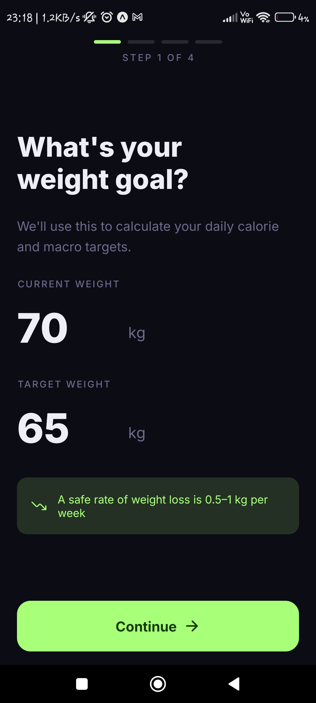
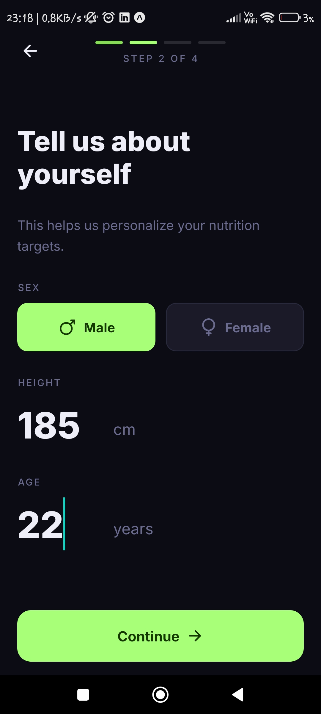
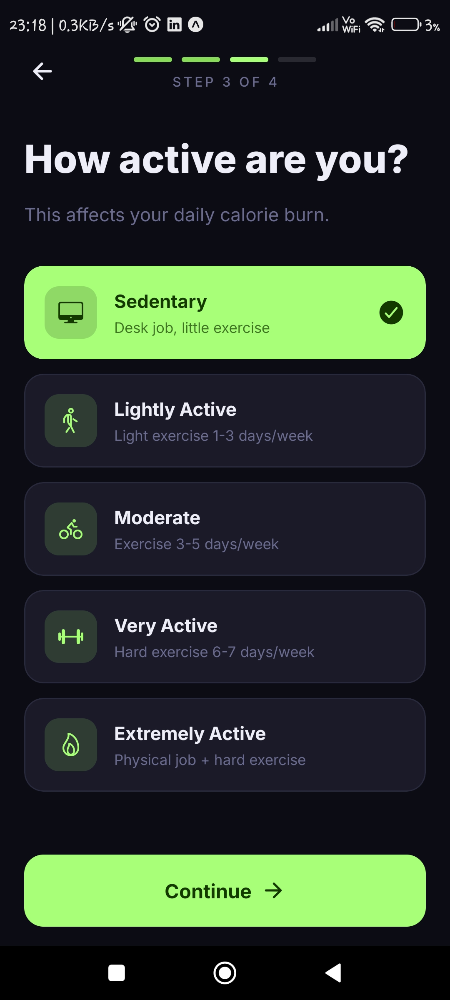
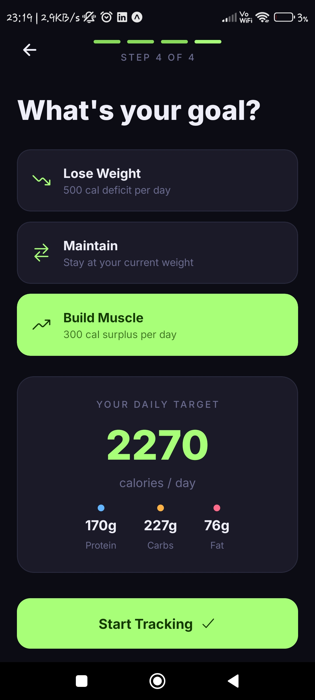
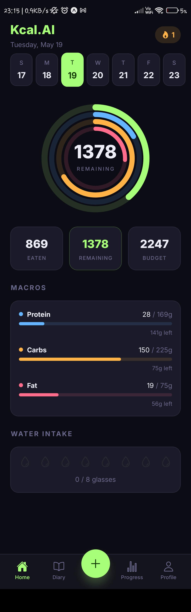
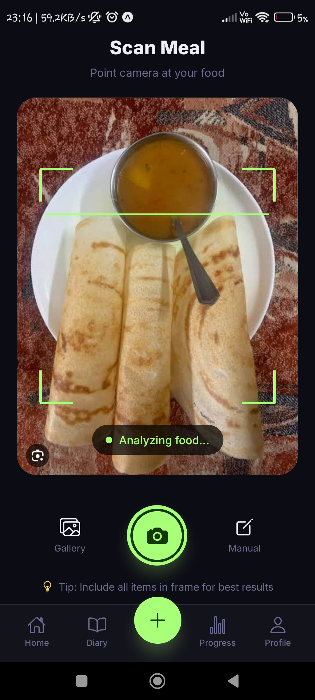
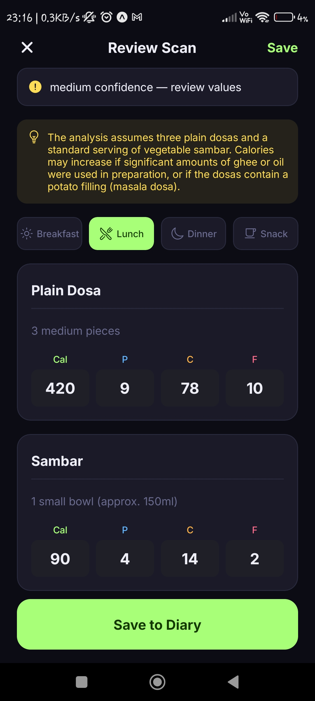
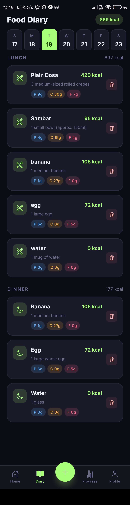
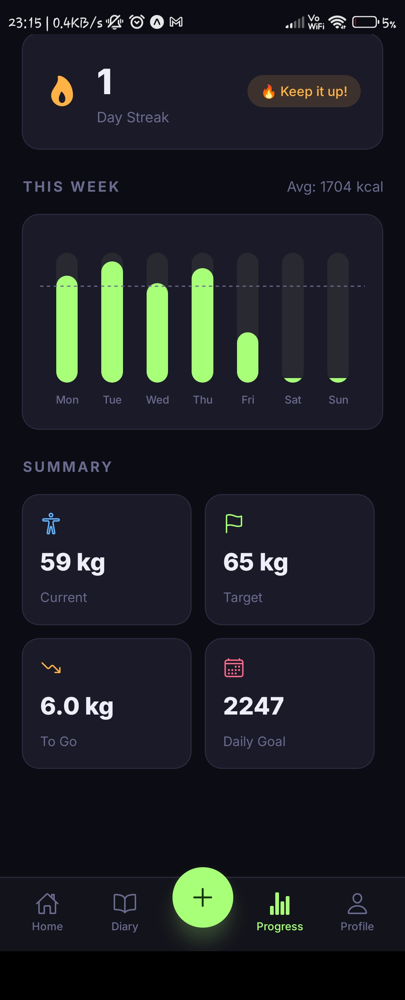

# Kcal.AI - Calorie Tracker

An AI-powered mobile application built with React Native and Expo that tracks calories by analyzing pictures of your food using the Google Gemini Vision API. It also features a personalised meal-suggestion assistant, voice/text meal logging, and a health impact dashboard — all running offline-first on your device.

## Prerequisites

- **Expo Go App**: Make sure you have the Expo Go app installed on your Android/iOS device. This project is built using Expo SDK 51.
- **Node.js**: Recommended version 18 or above.

## Getting Started

1. **Install Dependencies**
   Navigate into the `app` directory and install the necessary packages:
   ```bash
   cd app
   npm install
   ```

2. **API Key Setup**
   The app supports three AI providers. You need at least one key to enable AI features.

   **Option A — Google Gemini (recommended for photo scanning):**
   - Get your free API key from Google AI Studio: [https://aistudio.google.com/app/apikey](https://aistudio.google.com/app/apikey)
   - Create a file named `.env` in the `app` directory (`app/.env`) and add:
     ```env
     EXPO_PUBLIC_GEMINI_API_KEY=your_api_key_here
     ```
   - You can also enter the key in-app at **Settings → Gemini Key (vision/scanning)**.

   **Option B — Groq (free, great for meal suggestions):**
   - Get a free key at [https://console.groq.com/keys](https://console.groq.com/keys).
   - Enter it in-app at **Settings → AI Provider → Groq → Groq API Key**.

   **Option C — Custom OpenAI-compatible endpoint:**
   - Set your base URL and model ID in **Settings → AI Provider → Custom**.
   - Supports any OpenAI-compatible API (OpenRouter, local Ollama, etc.).

## Running the App

### Standard Local LAN Connection
The easiest way to run the app is over your Local Area Network (Wi-Fi). Ensure your phone and PC are on the same Wi-Fi network.

```bash
cd app
npx expo start -c
```
*Note: If Expo tries to connect to `127.0.0.1`, force it to use your local IP:*
```powershell
$env:REACT_NATIVE_PACKAGER_HOSTNAME="YOUR_LOCAL_IP_ADDRESS"; npx expo start -c
```
*(Replace `YOUR_LOCAL_IP_ADDRESS` with your actual PC Wi-Fi IP, e.g., `192.168.1.x`)*

### Windows Firewall Issues (LAN not connecting)
If the Expo server is running but your phone cannot connect (endpoint is offline), Windows Defender Firewall is likely blocking incoming connections on port 8081.

**To fix this permanently (Run in PowerShell as Administrator):**
```powershell
New-NetFirewallRule -DisplayName "Expo Metro Bundler (8081)" -Direction Inbound -LocalPort 8081 -Protocol TCP -Action Allow
```

### Ngrok Tunnel (Alternative Method)
If you are on a restrictive network (like a public cafe) or LAN isn't working, you can use a tunnel.
```bash
npx expo start -c --tunnel
```
*Troubleshooting:* If you get a `CommandError: TypeError: Cannot read properties of undefined (reading 'body')` or `ngrok tunnel took too long to connect`, it means the Ngrok tunneling service is currently experiencing outages or rate limits. In this case, use the LAN connection method above.

## Features

- **AI Photo Scanning** — point your camera at any meal and get instant calorie + macro estimates via Gemini Vision.
- **Text / Voice Logging** — describe a meal in plain English ("a bowl of dal rice with yogurt") and the AI extracts each item with macros automatically.
- **Personalised Meal Assistant** — time-aware suggestions (breakfast / lunch / dinner / snack) that respect your remaining macros, dietary style, allergies, and pantry.
- **Persistent AI Memory** — the assistant remembers your allergies, dislikes, favourites, cuisine preferences, cooking skill, and budget across sessions and provider changes.
- **Recipe Guide** — tap any suggestion to get step-by-step cooking instructions generated on the fly.
- **Multi-Provider AI** — swap between Gemini, Groq (free tier), or any OpenAI-compatible endpoint in Settings; the app falls back gracefully if a provider is unavailable.
- **Health Impact Card** — see an estimate of healthy-life minutes gained and CO₂ footprint for today's meals.
- **Progress Tracking** — weekly calorie chart, macro breakdown, and streak tracking.
- **Offline-First** — all data lives in AsyncStorage; no account or server required.

## Tech Stack
- React Native (Expo SDK 51)
- Google Gemini API (`gemini-flash-latest`) — photo vision + text
- Groq Cloud (OpenAI-compatible, free tier) — fast text suggestions
- TheMealDB API (free, no key) — real food photography
- TypeScript (strict mode)
- AsyncStorage — offline-first data layer

## Screenshots

| Onboarding: Weight Goal | Onboarding: Personal Info | Onboarding: Activity Level |
|:---:|:---:|:---:|
|  |  |  |

| Onboarding: Fitness Goal | Home Dashboard | Scan Meal |
|:---:|:---:|:---:|
|  |  |  |

| Review Scan Results | Food Diary | Progress Statistics |
|:---:|:---:|:---:|
|  |  |  |
