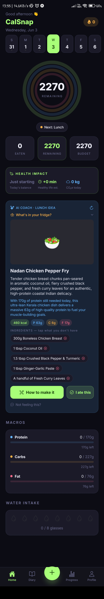
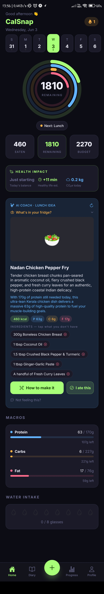
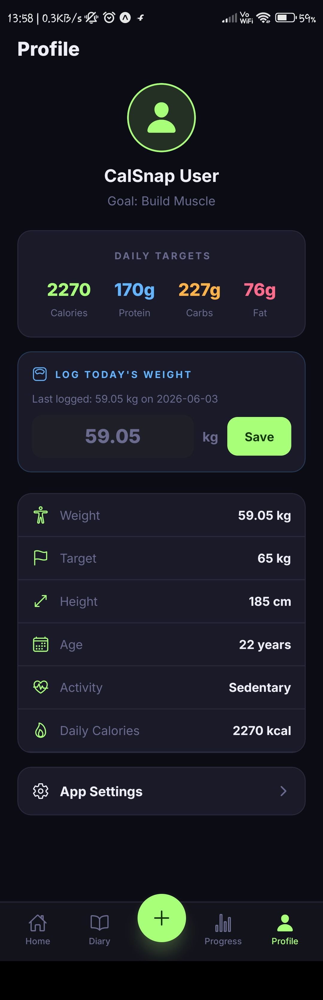
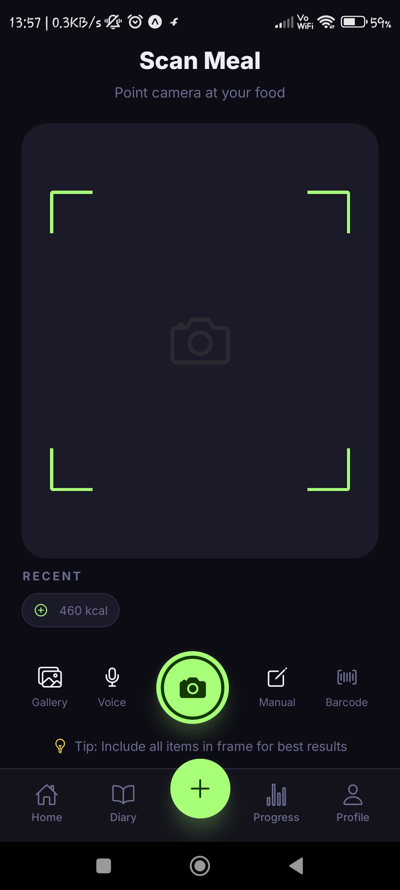
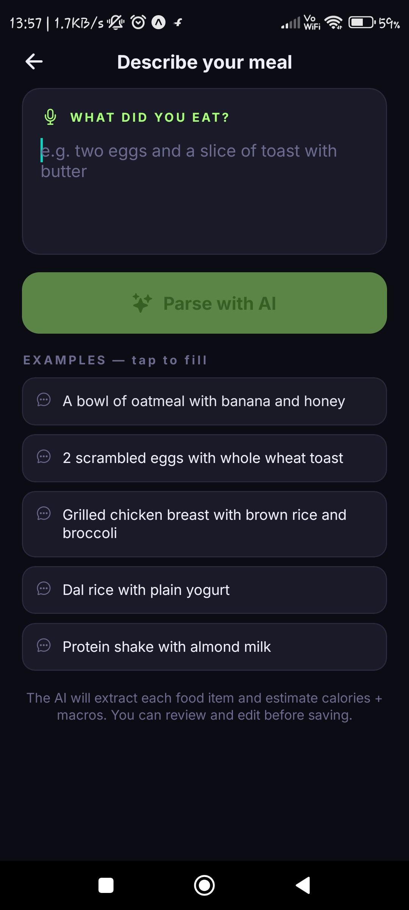
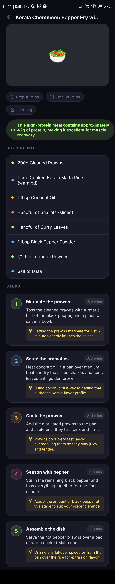
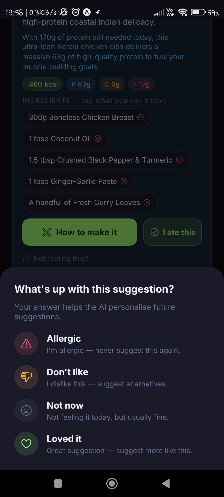
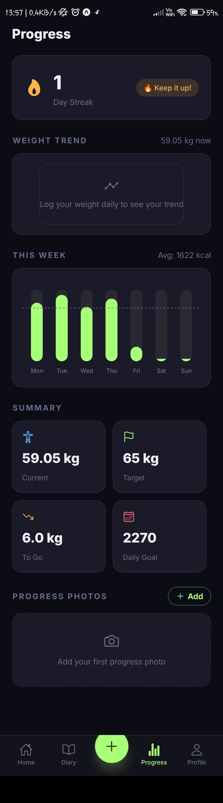

# CalSnap — AI-Powered Calorie Tracker

> Point your camera at any meal. Describe it in plain English. Get instant macros, personalised meal suggestions, step-by-step recipes, and health impact scores — all running offline-first on your device.

Built with **React Native + Expo**, powered by **Google Gemini Vision** and **Groq** (free tier), with a persistent AI memory that learns your allergies, preferences, and cooking style across sessions.

---

## Screenshots

### Onboarding — 4-Step Setup

| Step 1 · Weight Goal | Step 2 · Personal Details | Step 3 · Activity Level | Step 4 · Your Targets |
|:---:|:---:|:---:|:---:|
|  |  |  |  |
| Set current & target weight | Height, age & sex | Choose your activity level | Goal selected → daily macros calculated |

---

### Dashboard

| Home Dashboard | After Logging a Meal | Profile & Targets |
|:---:|:---:|:---:|
|  |  |  |
| AI coach, calorie rings & health impact | Health impact updates live · +11 min gained | Daily macro targets & body stats |

---

### Scanning a Meal — End to End

| Camera Viewfinder | Real Scan in Progress | AI Scan Results |
|:---:|:---:|:---:|
|  |  |  |
| Gallery · Voice · Camera · Manual · Barcode | Dosa + Sambar · "Analyzing food…" | Plain Dosa 420 kcal · Sambar 90 kcal |

---

### AI Features

| Voice / Text Logging | AI Recipe Guide | Feedback & Memory |
|:---:|:---:|:---:|
|  |  |  |
| Describe a meal, AI extracts every macro | Kerala prawn recipe · step-by-step tips | Allergic · Don't like · Loved it — AI remembers |

---

### Progress & Streak

<p align="center">
  
  <br>
  <em>1-day streak · weekly calorie chart · weight trend · summary stats</em>
</p>

---

## Features

- **AI Photo Scanning** — Gemini Vision analyses any food photo and returns instant calorie + macro estimates per item.
- **Voice / Text Logging** — Describe a meal in plain English ("a bowl of dal rice with yogurt") and the AI identifies every item with macros.
- **Personalised AI Coach** — Time-aware suggestions (breakfast / lunch / dinner / snack) fitted to your remaining macros, goal, and dietary style.
- **Persistent Memory** — The AI remembers your allergies, dislikes, favourites, dietary style, cooking skill, and budget across every session and provider change.
- **Pantry Mode** — Tell the AI what's in your fridge; it suggests only meals you can actually make right now.
- **Step-by-Step Recipes** — Tap any suggestion to get a full recipe with timings, tips, and a macro note — generated on the fly.
- **Health Impact Card** — Estimated healthy-life minutes gained and CO₂e footprint for the day, updating live after every meal.
- **Multi-Provider AI** — Swap between Gemini, Groq (free tier), or any OpenAI-compatible endpoint in Settings. Falls back gracefully when a provider is unavailable.
- **Progress Tracking** — Weekly calorie chart, macro breakdown, weight trend, and streak counter.
- **Offline-First** — All data in AsyncStorage. No account, no server, no lock-in.

---

## Tech Stack

| Layer | Technology |
|---|---|
| App framework | React Native · Expo SDK 51 |
| Vision AI | Google Gemini (`gemini-flash-latest`) |
| Text AI — suggestions, recipes, voice | Groq Cloud (free tier, OpenAI-compatible) |
| Food photography | TheMealDB (free, no key required) |
| Offline storage | AsyncStorage |
| Language | TypeScript (strict mode) |

---

## Prerequisites

- **Expo Go** on your Android or iOS device (SDK 51)
- **Node.js** 18+

---

## Getting Started

```bash
cd app
npm install
```

### API Key Setup

The app supports three AI providers. You need at least one key to enable AI features.

**Option A — Google Gemini (recommended for photo scanning)**

Get a free key at [Google AI Studio](https://aistudio.google.com/app/apikey), then create `app/.env`:

```env
EXPO_PUBLIC_GEMINI_API_KEY=your_key_here
```

You can also enter it in-app at **Settings → Gemini Key (vision/scanning)**.

**Option B — Groq (free tier, great for suggestions)**

Get a free key at [console.groq.com](https://console.groq.com/keys), then enter it at **Settings → AI Provider → Groq**.

**Option C — Custom OpenAI-compatible endpoint**

Set your base URL and model at **Settings → AI Provider → Custom** (OpenRouter, local Ollama, etc.).

---

## Running the App

### LAN (recommended)
Ensure your phone and PC share the same Wi-Fi network.

```bash
cd app
npx expo start -c
```

If Expo falls back to `127.0.0.1`, force your local IP:

```powershell
$env:REACT_NATIVE_PACKAGER_HOSTNAME="YOUR_LOCAL_IP"; npx expo start -c
```

### Windows Firewall fix

```powershell
# Run as Administrator
New-NetFirewallRule -DisplayName "Expo Metro Bundler (8081)" -Direction Inbound -LocalPort 8081 -Protocol TCP -Action Allow
```

### Ngrok tunnel (restrictive networks)

```bash
npx expo start -c --tunnel
```

---

## Project Structure

```
app/
├── app/
│   ├── (onboarding)/      # 4-step setup wizard
│   ├── (tabs)/            # Home · Diary · Progress · Profile
│   ├── scan.tsx           # Camera capture + Gemini Vision
│   ├── voice-record.tsx   # Text / voice meal logging
│   ├── review-edit.tsx    # Confirm & edit before saving
│   └── settings.tsx       # Provider switcher + API keys
├── components/
│   ├── AssistantCard.tsx  # AI coach with memory & feedback
│   └── HealthImpactCard.tsx
├── context/AppContext.tsx  # Global store (useApp hook)
└── lib/
    ├── ai-providers.ts    # Gemini / Groq / Custom abstraction
    ├── assistant-memory.ts # Persistent AI memory (AsyncStorage)
    ├── meal-assistant.ts  # Suggestions + recipe generation
    ├── voice-parse.ts     # Natural language → ScanResult
    ├── ai-scan.ts         # Gemini Vision call
    ├── nutrition.ts       # BMR → TDEE → macro math
    └── storage.ts         # All AsyncStorage I/O
```
